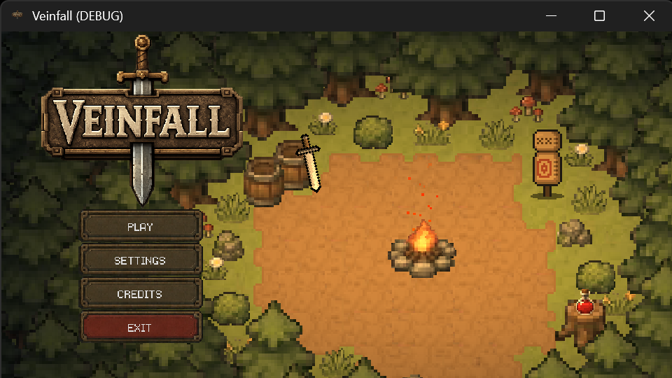
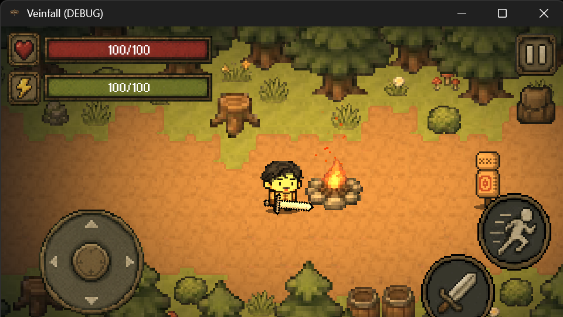
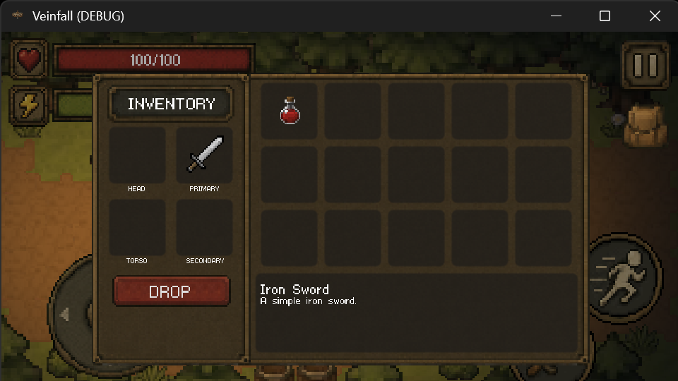

# ⚔️ Veinfall

A dungeon-crawling **action game built with Godot**.

You are an adventurer sent by your kingdom to conquer dangerous dungeons and face the challenges that await within.

This project was created as a personal game development project to practice **Godot, GDScript, player movement, combat systems, animations, UI development, input handling, and game development fundamentals**.

---

## ✨ Features

### ⚔️ Combat

The player can attack using the configured attack input.

* ⚔️ Attack
* 🗡️ Weapon-based combat
* 🎯 Player-controlled actions

### 🏃 Movement

The player can move in four directions using standard keyboard controls.

* ⬆️ Move Up
* ⬇️ Move Down
* ⬅️ Move Left
* ➡️ Move Right

The game also includes a dodge action for quickly avoiding danger.

### 🎒 Inventory

Veinfall includes an inventory input that can be opened during gameplay.

* Open Inventory
* Return from Inventory

### 🎮 Player Interaction

The game includes an interaction input that can be used for interacting with objects or gameplay elements.

* Interact with `E`
* Dodge with `Q`
* Attack with `Space`
* Open Inventory with `I`

---

# 🎮 Controls

| Action     | Keyboard  |
| ---------- | --------- |
| Move Up    | `W` / `↑` |
| Move Down  | `S` / `↓` |
| Move Left  | `A` / `←` |
| Move Right | `D` / `→` |
| Dodge      | `Q`       |
| Attack     | `Space`   |
| Inventory  | `I`       |
| Back       | `Esc`     |
| Interact   | `E`       |
| Test       | `T`       |

The controls are configured through Godot's Input Map.

---

# 📸 Screenshots

Here are some screenshots of **Veinfall** in action.

### 🏰 Gameplay



---

### ⚔️ Combat



---

### 🎒 Inventory



---

# 📁 Project Structure

```text
veinfall/

│
├── assets/
│   └── ...
│
├── scenes/
│   └── ...
│
├── scripts/
│   └── ...
│
├── screenshots/
│   ├── gameplay.png
│   ├── combat.png
│   └── inventory.png
│
├── project.godot
│
├── README.md
└── ...
```

> The project structure above is an example layout for organizing the repository. Update it to match the actual folders and files in your Godot project.

---

# 🎮 Game Information

### 🏰 Setting

The player takes the role of an adventurer who has been sent by their kingdom to conquer dungeons.

The goal of the game is to venture into these dangerous areas and overcome the challenges within.

The game's project description is currently set to:

```text
You're an adventurer who is sent from your kingdom to conquer dungeons.
```

---

# ⚙️ Project Settings

Veinfall is configured as a **Godot 4.7 mobile project**.

### Display

The game uses a viewport resolution of:

```text
960 × 540
```

The project uses canvas-item stretching with an expandable aspect ratio.

### Rendering

The project is configured to use Godot's **Mobile renderer** with pixel-style texture filtering.

### Touch Input

Mouse input is configured to emulate touch input, allowing the project to support touch-oriented interaction.

---

# 🛠️ Built With

* **Godot 4.7** — Game engine

* **GDScript** — Programming language

* **Godot Input Map** — Player controls and input handling

---

# 🚀 Getting Started

## Requirements

* **Godot 4.7**
* A computer capable of running Godot projects

## Running the Game

Clone the repository:

```bash
git clone https://github.com/joshwell-glitch/veinfall.git
```

Navigate into the project:

```bash
cd veinfall
```

Open the project using **Godot 4.7**.

Run the project using the **Play Project** button in the Godot editor.

---

# 📌 Current Limitations

Veinfall is currently a **work in progress**.

The project is still under active development, so gameplay systems, mechanics, UI, enemies, dungeon content, and other features may change as development continues.

Some features may also be incomplete or experimental.

---

# 🎯 Learning Goals

This project was created to practice:

* Godot game development
* GDScript programming
* Player movement
* Combat systems
* Dodge mechanics
* Animation systems
* Input handling
* GUI and HUD development
* Inventory systems
* Game scene organization
* Mobile-oriented game development
* Game development fundamentals

---

# 📜 Asset & Usage Policy

All original **Veinfall assets and project content are protected by the author**.

This includes, but is not limited to:

* 🎨 Artwork and pixel art
* 🗺️ Maps and level designs
* ⚔️ Weapons and item assets
* 👾 Character and enemy assets
* 🎞️ Animations
* 🎵 Audio and sound effects created for the project
* 💻 Original scripts and code
* 🖥️ UI elements and designs
* 📁 Other original project files and assets

**Do not copy, redistribute, modify, re-upload, sell, or use these assets in your own projects without permission from the author.**

The Veinfall repository being publicly visible **does not mean that its assets are free to use**.

If you would like to use or reference any of the project's original assets, please **ask for permission first**.

> **Please respect the work that goes into creating these assets. Do not steal or redistribute them.**

---

# 👨‍💻 Author

**Joshwell**

Created as a personal game development project.

---

⭐ **Thanks for checking out Veinfall!**
